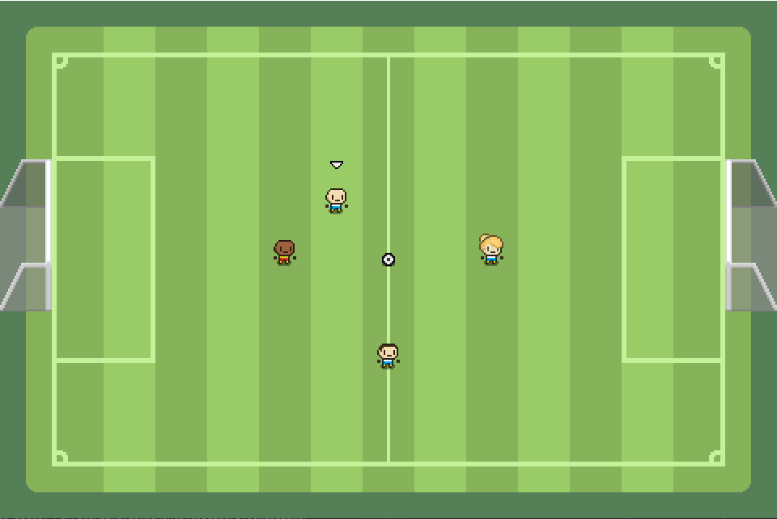
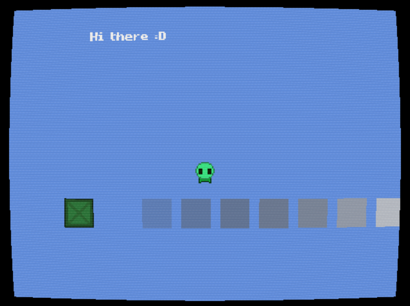

  
  

# Ferret Engine

Ferret is a simple game engine developed in C# with [FNA](https://github.com/FNA-XNA/FNA), 
started as a project for the [devtober](https://twitter.com/devtober) challenge.

  

It's objective is to be an easy-to-use, code-first engine, which can be used to build efficient
and good-looking 2D games.

## Features

Ferret is still in *very* early stages of development. Some of the already existent 
functionality can be listed as follows:

- Composable Game Object structure
- Layer-based scenes
- Simple collision system
- Coroutine handling
- Material and shader support
- Particle system
- TTF font support
- Full control of the game for the programmer

## Getting Started

You can pull the Ferret repository with: `git clone --recursive https://github.com/pacojq/Ferret.git`.
Make sure you're using `--recursive`!

If you are using Ferret as a **git submodule**, execute: `git submodule update --init --recursive`.

Also, you may need the following:

- **MonoGame**, required to build content with its Pipeline tool. You can get it from its 
[website](http://www.monogame.net/downloads/).

- **DirectX SDK (June 2010)** for building shaders.
  - **On Windows** : Download it [here](https://www.microsoft.com/en-us/download/details.aspx?id=6812).
  - **On Linux/macOS:** Install using Wine and winetricks.

- **FNA Dependencies**, already added as a submodule of Ferret

## The Sandbox App

`FerretEngine.Sandbox` is a really nice place to experiment with the different features Ferret offers. 
It's also a good starting point to build your own game!

  

## Development Goals

### Short term

In short term, the objective of the project is to create an engine capable of building a commertial game. 
These are the most important features planned for the Ferret engine:

 - [ ] Audio support
 - [ ] Wider font format support
 - [ ] Entities serialization
 - [ ] Pathfinding module
 - [ ] Proper online documentation
 
### Long term

In long term, the Ferret Engine will grow with more functionality and quality-of-live improvements. 
Some examples are listed below:

 - [ ] UI library
 - [ ] Shader library
 - [ ] Lighting
 - [ ] [Premake](https://premake.github.io) to generate Ferret projects
 - [ ] Multi-threading
 - [ ] Editor: Scene editor
 - [ ] Editor: Animation editor
 - [ ] Editor: Particle previewer

## License

Ferret is under [MIT License](/LICENSE).
Also, as FNA runs under the hood, please check out the [FNA License](https://github.com/FNA-XNA/FNA/tree/master/licenses).
